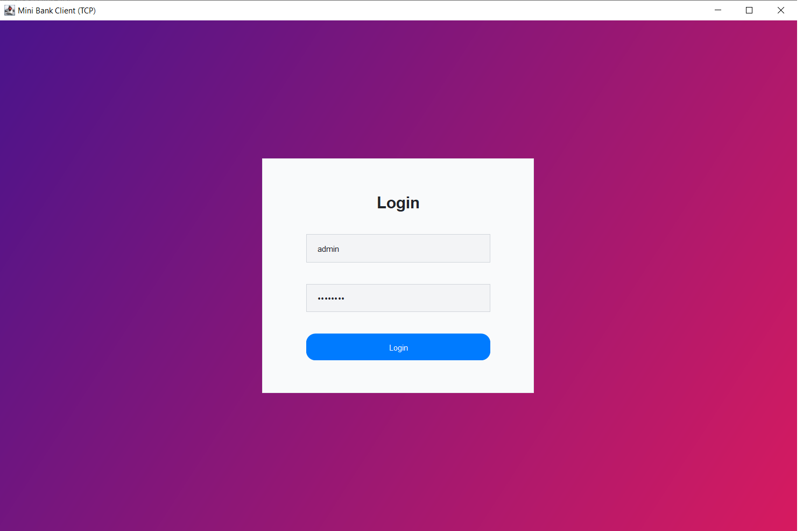
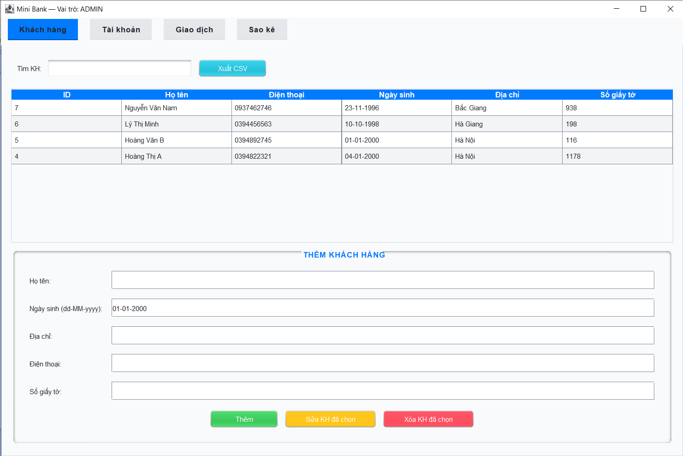
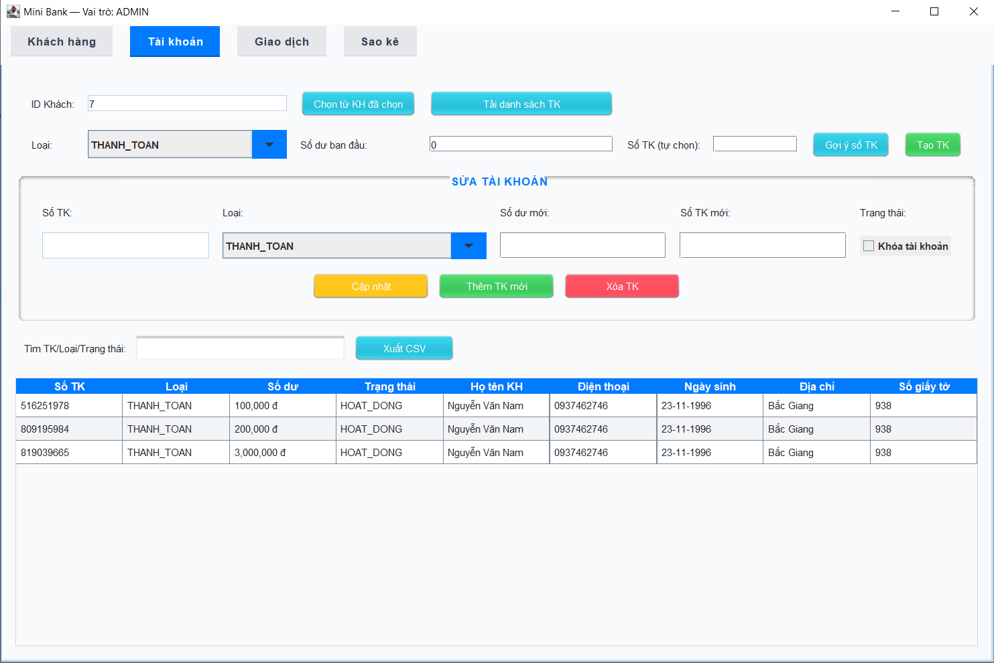
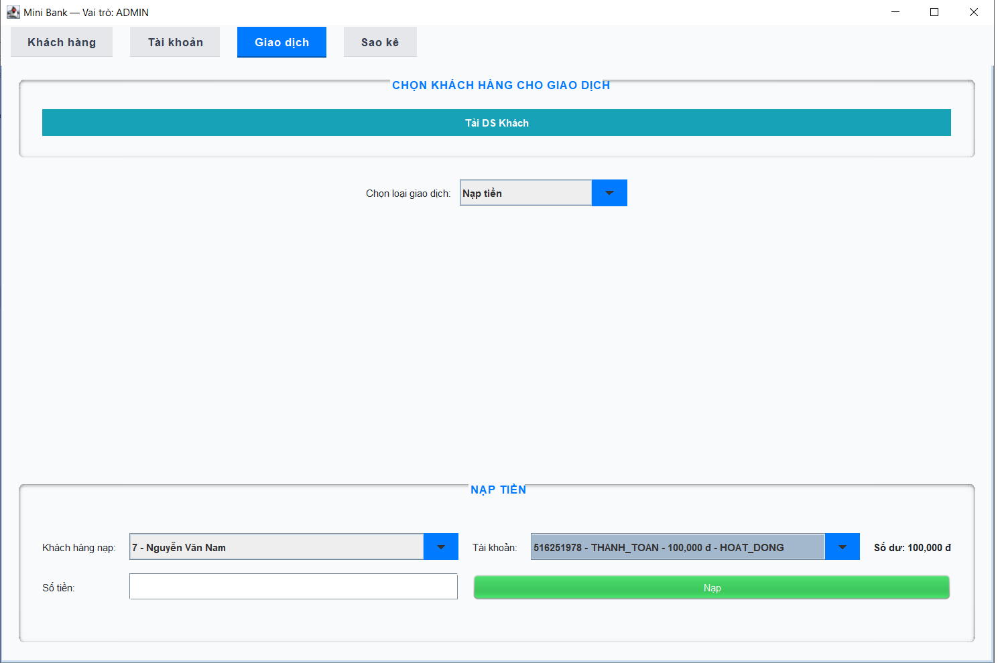
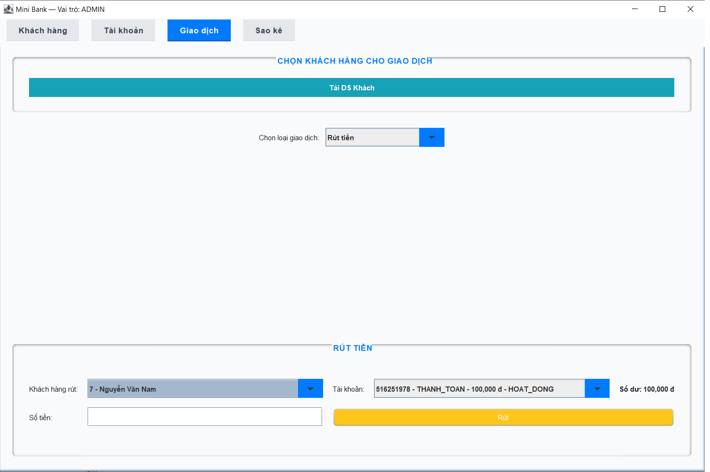
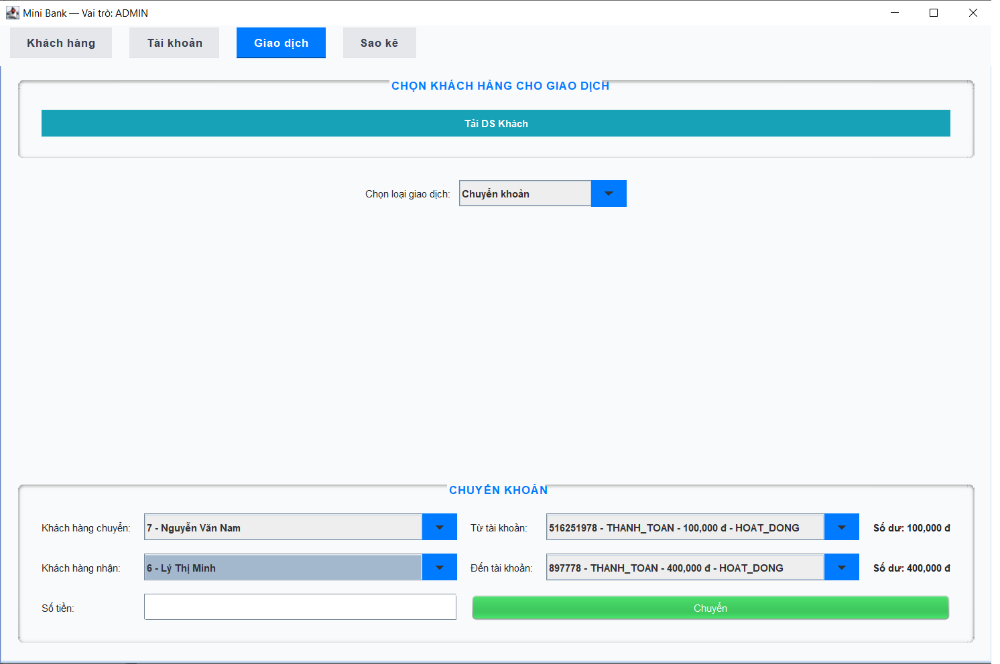
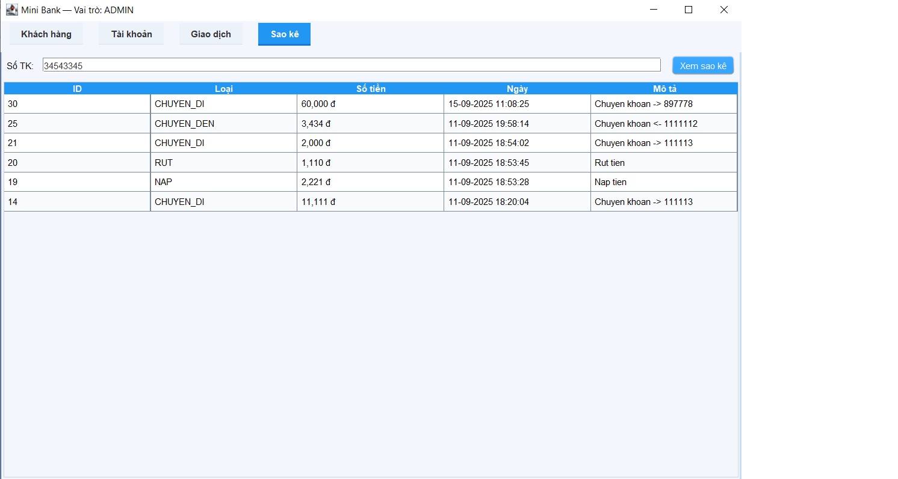

<h2 align="center">
    <a href="https://dainam.edu.vn/vi/khoa-cong-nghe-thong-tin">
    🎓 Faculty of Information Technology (DaiNam University)
    </a>
</h2>
<h2 align="center">
    HỆ THỐNG QUẢN LÝ NGÂN HÀNG MINI
</h2>
<div align="center">
    <p align="center">
        
        
        
    </p>

[](https://www.facebook.com/DNUAIoTLab)
[](https://dainam.edu.vn/vi/khoa-cong-nghe-thong-tin)
[](https://dainam.edu.vn)

</div>

---
## 1. Giới thiệu hệ thống
Hệ thống Quản lý Ngân hàng Mini gồm 2 tiến trình: máy chủ (Server) xử lý nghiệp vụ và ứng dụng khách (Client) giao diện Swing. Hỗ trợ quản lý khách hàng, tài khoản, giao dịch (nạp/rút/chuyển), sao kê, phân quyền người dùng, tìm kiếm/sắp xếp, chỉnh sửa thông tin tài khoản. Giao tiếp Client ↔ Server qua TCP bằng giao thức key=value.  

Các đặc điểm nổi bật:
- Tạo tài khoản với số tự chọn (kiểm tra trùng), có gợi ý số TK trống.  
- Đổi số tài khoản an toàn ràng buộc khóa ngoại (transaction copy→move→delete).  
- Tìm kiếm + sắp xếp dữ liệu bảng với TableRowSorter/RowFilter.  
- Thông báo lỗi rõ ràng từ server (ví dụ: “Số tài khoản đã tồn tại: <số>”).  

---

## 2. Ngôn ngữ & Công nghệ sử dụng
<div align="center">

[](https://www.oracle.com/java/)
[]()
[](https://www.mysql.com/)
[]()

</div>

---

## 3. Hình ảnh các chức năng
<p align="center">
  
  <br/>
  <em>Hình 1. 🖥️ Giao diện chức năng đăng nhập</em><br/>
</p>
---
<p align="center">
  
  <br/>
  <em>Hình 2. 🖥️ Giao diện chức năng quản lý thông tin khách hàng (thêm, sửa, xóa, xuất file csv)</em><br/>
</p>
---
<p align="center">
  
  <br/>
  <em>Hình 3. 🖥️ Giao diện chức năng quản lý thông tin tài khoản khách hàng (thêm, sửa, xóa, xuất file csv)</em><br/>
</p>
---
<p align="center">
  
  <br/>
  <em>Hình 4. 🖥️ Giao diện chức năng nạp tiền</em><br/>
</p>
---
<p align="center">
  
  <br/>
  <em>Hình 5. 🖥️ Giao diện chức năng rút tiền</em><br/>
</p>
---
<p align="center">
  
  <br/>
  <em>Hình 6. 🖥️ Giao diện chức năng chuyển khoản</em><br/>
</p>
---
<p align="center">
  
  <br/>
  <em>Hình 7. 🖥️ Giao diện chức năng sao kê lịch sử (nạp, rút, chuyển)</em><br/>
</p>

## 4. Các bước cài đặt
1. **Cài đặt môi trường**  
   - JDK 8 trở lên  
   - MySQL 5.7+ hoặc 8.0+  
   - IDE khuyến nghị: IntelliJ IDEA / Eclipse / NetBeans  

2. **Tạo cơ sở dữ liệu**  
   - Tạo database `bankmini` trong MySQL  
   - Chạy file `bankmini.sql` (DDL) để tạo bảng: Customers, Accounts, Transactions, Users  

3. **Cấu hình kết nối MySQL**  
   Mở file `src/btl/CauHinh.java` và chỉnh lại thông tin:  
   ```java
   public static final String DB_URL = "jdbc:mysql://localhost:3306/bankmini?useSSL=false&serverTimezone=UTC";
   public static final String DB_USER = "<user>";
   public static final String DB_PASS = "<pass>";

## 5. Thông tin liên hệ  
Họ tên: Hoàng Mạnh Linh.  
Lớp: CNTT 16-03.  
Email: linhmanhhoang03@gmail.com.

© 2025 AIoTLab, Faculty of Information Technology, DaiNam University. All rights reserved.

---
